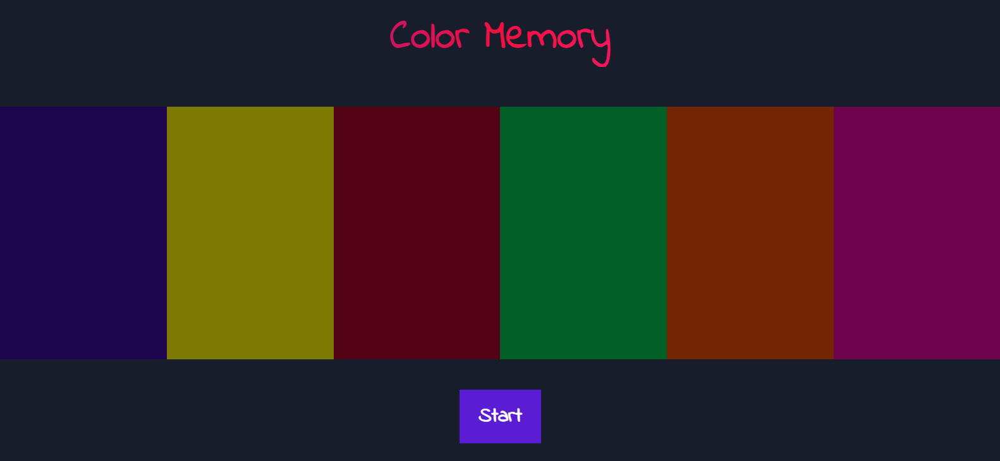
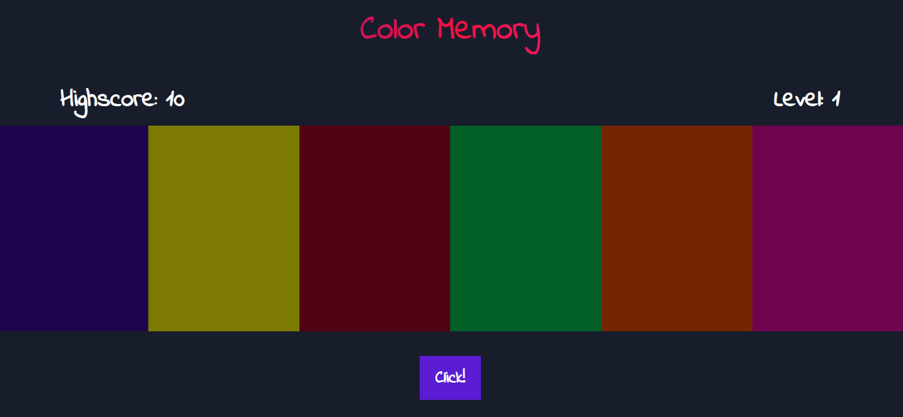

  

    
  

# Color Memory

  
  
  

<h3>A fun game to stimulate memory made with JS.</h3>

 

  
  
  

  

---

## 🕹 How to play

Color memory is a game much like the famous "Genius", following the same principles.

To play color memory, after you click Start, you have to listen carefully on which color tile lights up, you will have to memorize it.

After the sound is played, the button will say "Click!" and you have to touch the tile that was played. If you're right, the game will proceed, and the number of colors played will increase in each level, you will have to play the correct order.

The game has a Light mode (first screenshot) and a Dark mode (second screenshot) for better contrast view.

---

## 🤝 Contributing

Contributions, issues and feature requests are welcome! Feel free to check [issues page](https://github.com/abacaxiguy/color-memory/issues).

---

## 📋 Tested in

-   Windows 10 (Chrome 1600x900)

---

<h4  align="center">Developed by 🍍</h4>
